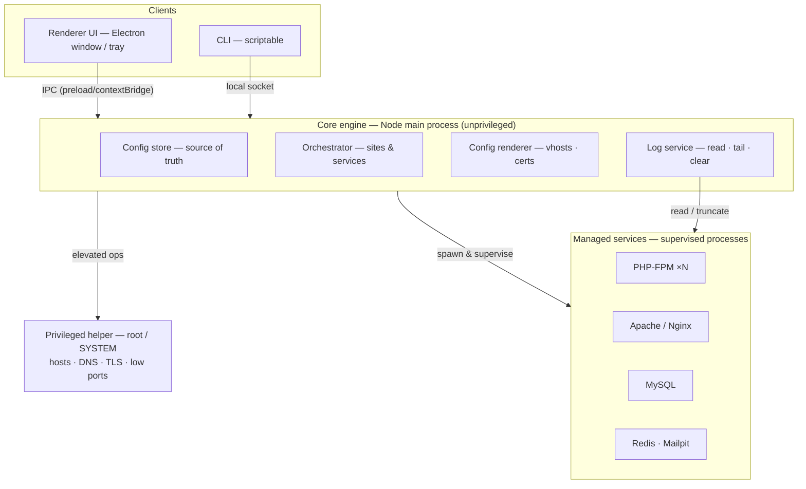

# Local Dev Environment Manager — Technical Plan

A native local development environment manager in the spirit of Laravel Herd, Laragon,
and XAMPP: manage PHP versions, web servers, databases, and `.test` domains with trusted
local HTTPS, behind a clean GUI and CLI.

**UI runtime:** Electron.
**Engine:** Node.js (TypeScript), in the Electron main process.
**Web servers:** Apache and Nginx (switchable per environment).
**Database:** MySQL (PostgreSQL / Redis optional).
**Assumption:** greenfield build, cross-platform core, **ship one OS first**.

---

## 1. The framing

Tools in this category live or die on a small set of **privileged, OS-specific operations**:

- Binding to ports 80 / 443
- Editing the system `hosts` file
- Configuring DNS resolution for a local TLD (`.test`)
- Installing a trusted root CA for local HTTPS

Everything else (process supervision, config generation, the UI, the log viewer) is
comparatively easy. The architecture isolates that hard ~10% into one small, audited
component so the rest of the system stays simple and unprivileged.

---

## 2. Decisions already made

- **Target one platform first.** macOS / Linux give clean per-TLD DNS via `/etc/resolver`;
  Windows has no equivalent and is the hard target (see §7.2). Pick one to start.
- **Bundle a minimal core, download extra versions on demand.** Ship one PHP, one web
  server, MySQL; pull additional PHP/DB versions when the user asks.
- **Engine in the Electron main process (Node/TS).** Renderer is a pure client. A small,
  separate, signed **privileged helper** does the elevated operations (§7.1) — required
  regardless of language, since Node cannot escalate itself.

---

## 3. Architecture

Layered design with a **hard privilege boundary**. The unprivileged Node engine does all
orchestration; it talks over local IPC to a tiny privileged helper that performs *only*
root/SYSTEM operations. The renderer and CLI are clients of the engine — they never touch
the system directly.



### Governing principle: config as the single source of truth
One declarative file (e.g. `~/.devmgr/config.toml`) lists every site, its PHP version, doc
root, and enabled services. The engine **renders** all derived artifacts from it — Apache /
Nginx vhosts, PHP-FPM pools, DNS entries, **and all log paths** — then reloads them. Because
the engine owns the configs, it also owns where every service writes its logs, which is what
makes the log viewer (§6) tractable.

---

## 4. Tech stack

- **UI:** Electron. Keep `contextIsolation` on and `nodeIntegration` off; expose the engine
  to the renderer only through a vetted `preload` + `contextBridge`.
- **Engine:** TypeScript in the main process. Supervised service binaries (Apache, Nginx,
  PHP-FPM, MySQL) are spawned by the main process, never the renderer.
- **Web servers:** Apache and Nginx, switchable. The engine generates vhosts for whichever
  is active. **TLS is now self-managed** (no Caddy auto-HTTPS): a local CA + a wildcard
  `*.test` certificate, mkcert-style (see §7.3).
- **Database:** MySQL. (Licensing note: MySQL is GPL / Oracle-owned — fine for a dev tool,
  but keep it in mind if you ever bundle and redistribute. MariaDB remains a drop-in
  alternative if that becomes a concern.)
- **Dev extras:** Mailpit for mail catching; Redis optional.
- **Privileged helper:** small signed native binary — `SMAppService` daemon (macOS),
  Windows Service as `LocalSystem` (Windows), polkit-fronted helper (Linux).

---

## 5. Core subsystems

- **Service orchestration** — start / stop / supervise Apache/Nginx, PHP-FPM, MySQL; detect
  crashes and restart.
- **PHP version management** — one FPM master per version on its own socket; per-site
  selection routes `fastcgi_pass`/proxy to the right socket; default `php` on `PATH` is a shim.
- **Site discovery ("park" model)** — point at a directory and every subfolder becomes
  `<name>.test`, with framework detection (Laravel, WordPress) to pick the doc root.
- **Log viewer** — see §6.
- **DNS / TLS / vhost generation** — see §7.
- **CLI** — mirrors every GUI action.

---

## 6. Log viewer

Goal: one panel to read, follow, search, and clear logs for Apache, Nginx, PHP, MySQL, and
per-site Laravel logs.

### 6.1 Centralize logs into one managed tree
Because the engine generates every service config, point all service logs into one
predictable tree:

```
~/.devmgr/logs/
  apache/{access.log, error.log}        # or per-site under sites/
  nginx/{access.log, error.log}
  php/<version>/{php-error.log, fpm.log}
  mysql/{error.log, slow.log, general.log}
  sites/<site>/{access.log, error.log}
```

Laravel is the exception — its logs live **inside the project** at
`<project>/storage/logs/laravel*.log`. The engine already knows each site's doc root
(`public/`), so the project root is its parent; detect Laravel and resolve
`../storage/logs/*.log` from there (handle both the single `laravel.log` and daily
`laravel-YYYY-MM-DD.log` channels).

### 6.2 Sources surfaced in the UI
- **Apache** — access log + error log (global and/or per site).
- **Nginx** — access log + error log.
- **PHP** — the PHP `error_log` and the PHP-FPM log, per installed version.
- **MySQL** — error log always; **slow** and **general** logs toggle-able on demand from the
  viewer (they are verbose — enable via `SET GLOBAL general_log=ON` and a managed
  `general_log_file`, off by default).
- **Laravel** — `storage/logs/laravel*.log` per detected Laravel site.

### 6.3 Reading and following (Node specifics)
- The engine exposes a `LogService` over IPC:
  `listSources()`, `readTail(id, lines)`, `follow(id)`, `unfollow(id)`, `clear(id)`,
  `clearAll()`. `follow` streams appends to the renderer via `webContents.send('log:append', …)`.
- **Never load whole files.** For initial view, reverse-read the last N KB and split into
  lines; paginate upward on demand. Logs can reach gigabytes.
- **Tailing:** watch with `chokidar` (or `fs.watch`), track a byte **offset**, and read only
  newly appended bytes. If the file's size drops below the last offset, it was cleared or
  rotated — reset the offset to 0.
- **Parsing:** best-effort structured parse per type (timestamp, level, message) to enable
  level filtering (error / warning / info), text search, and time-range filtering. Apache/
  Nginx access logs are combined format; error logs and PHP/Laravel/MySQL each differ. Always
  keep a raw-line fallback view.

### 6.4 Clear logs with one click — do it safely
The non-obvious part. **Truncate, don't delete.** Deleting a log file out from under a
running service breaks things: on Windows you often can't unlink an open file, and on Linux
the service keeps writing to the now-orphaned inode. So `ftruncate(path, 0)`, then tell the
service to **reopen** its log handle — otherwise a process that holds an open fd keeps writing
at the old offset and the file becomes sparse (a wall of leading zero bytes).

| Service | After truncate, reopen via |
|---|---|
| Apache | `apachectl -k graceful` (reopens logs on graceful restart) |
| Nginx | `nginx -s reopen` |
| PHP-FPM | send `SIGUSR1` to the FPM master (reopen logs) |
| MySQL | `FLUSH ERROR LOGS` / `FLUSH LOGS` (server reopens log files) |
| Laravel | safe to truncate or delete — Monolog recreates the file on next write |

Offer both "clear this log" and "clear all", each behind a confirmation. "Clear all" iterates
the managed tree, truncates, then issues the reopen for each affected service.

### 6.5 Security
The renderer is semi-trusted. The `LogService` must operate on a **path allowlist** derived
from config (the managed log tree + detected Laravel log dirs) and reject any path outside it.
Resolve real paths and refuse symlinks that escape the allowed roots. The renderer sends a
**source id**, never a raw filesystem path.

---

## 7. The hard problems

### 7.1 Privilege escalation, done safely
The engine never runs as root. Elevated actions go through the helper over an authenticated
local channel (XPC on macOS, named pipe on Windows) with a fixed, auditable allow-list.

### 7.2 Wildcard DNS — the platform divider
- **macOS / Linux (clean):** a tiny resolver (or `dnsmasq`) on `127.0.0.1` + an
  `/etc/resolver/test` file → `*.test` resolves locally with zero `hosts` edits.
- **Windows (the pain):** no per-TLD resolver. Either edit `hosts` per site (no wildcard,
  Laragon-style) or run a local DNS forwarder set as the adapter's DNS (wildcard, but
  intrusive and fragile across network changes). Decide on day one.

### 7.3 Trusted local HTTPS (self-managed now)
With Apache/Nginx there is no auto-HTTPS, so the engine owns it: generate a local CA, install
it into the OS trust store **and** Firefox's separate NSS store (a helper job), issue a
wildcard `*.test` leaf, and write the TLS directives into the generated vhosts. Handle renewal.

### 7.4 Port conflicts
Detect what already holds 80 / 443 / 3306 (existing XAMPP, Docker, IIS, system services) and
offer alternate ports or to stop the conflicting service.

---

## 8. Roadmap

- **Phase 0 — Spike (2–3 wks):** privileged helper + IPC, wildcard DNS, a trusted local cert,
  one site served at `app.test` over HTTPS. No UI. De-risk only.
- **Phase 1 — MVP (4–8 wks):** Node engine + CLI, config-as-source-of-truth, park-a-directory
  with auto `.test`, one PHP version, Apache (or Nginx) with local HTTPS, MySQL, **basic log
  viewer (read + tail)**. Minimal tray.
- **Phase 2 — v1:** full Electron GUI, multiple PHP versions, Apache↔Nginx switch, service
  toggles (Redis, Mailpit), **full log viewer (filtering, search, clear-with-reopen, Laravel
  detection, MySQL slow/general toggles)**, self-update.
- **Phase 3 — v1.x:** second OS, framework auto-detection for doc roots, Xdebug toggle,
  queue/worker management, per-site isolation.
- **Phase 4 — v2:** plugins, shareable team configs, Docker interop, dashboards.

---

## 9. Risks to track

- **Windows wildcard DNS** — the top UX risk; spike before committing to Windows.
- **Code signing / notarization** — non-optional. A tool that edits `hosts` and installs a CA
  will trip antivirus, Gatekeeper, and SmartScreen if unsigned. Budget for an Apple Developer
  account and a Windows code-signing certificate.
- **Firefox trust store** is separate (NSS) — handle it explicitly.
- **Log truncation on Windows** — you cannot always truncate an open file; rely on the
  service's own reopen/flush mechanism (§6.4) rather than fighting the OS.
- **Patching burden** — you own security updates for everything you bundle.
- **Electron hardening** — `contextIsolation` on, `nodeIntegration` off, engine exposed only
  through a vetted preload bridge; the log path allowlist is part of this surface.