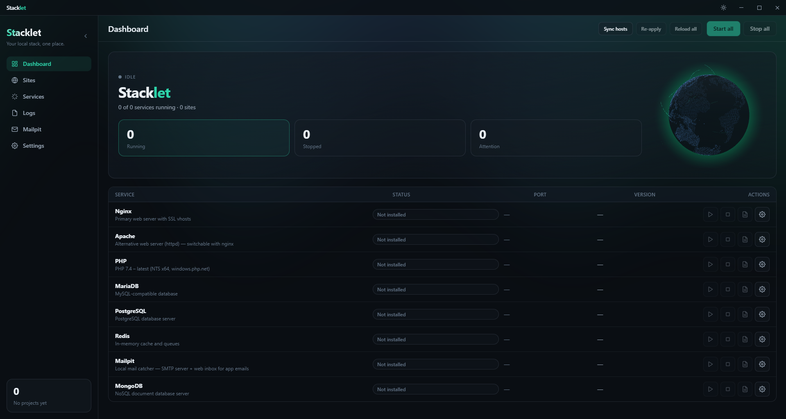
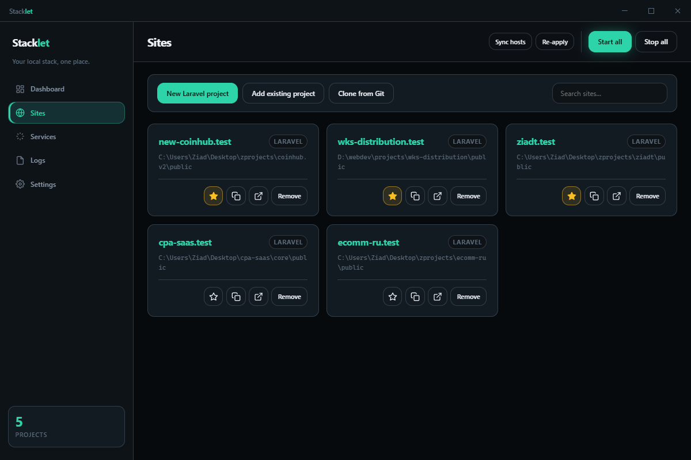
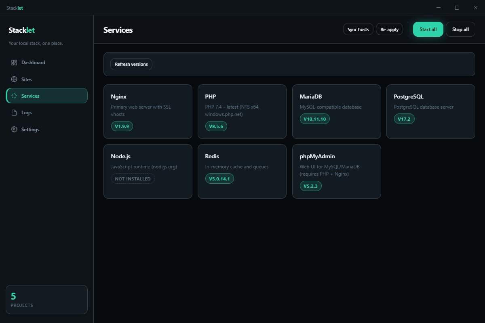

# Stacklet

> **Early development** — Stacklet is under active development (v0.1.0).
> Expect bugs, incomplete features, and breaking changes.
> Use at your own risk; not recommended for critical machines yet.

[](https://github.com/zsnakeee/stacklet/actions/workflows/ci.yml)

**Your local stack, one place.**

Stacklet is a Windows desktop app for PHP/Laravel developers: nginx **or Apache**, multiple PHP versions, MySQL/MariaDB, PostgreSQL, Redis, MongoDB, Mailpit, Node.js, Python, phpMyAdmin, `.test` sites with trusted local HTTPS, and PATH sync — Herd/Laragon-style without manual config.

## Screenshots

**Dashboard**



**Sites**



**Services**



## Status

- **Windows only** (for now)
- **Early preview** — feedback and [issue reports](https://github.com/zsnakeee/stacklet/issues) are welcome

## Requirements

- Windows 10/11
- Node.js 22+
- npm

## Features

**UI**
- Modern React UI (Vite + Tailwind) with **light/dark theme**, collapsible sidebar, dashboard, sites, services, logs, Mailpit inbox, and settings — runs in the tray.

**Web servers & PHP**
- **nginx _or_ Apache** — install both and switch in Settings (PHP served via FastCGI on both).
- Multiple PHP versions; set a global default **or isolate a specific version per site** (herd-`isolate`-style — a dedicated php-cgi per isolated version).
- **Xdebug on-demand** — XDEBUG-triggered requests are routed to an Xdebug-enabled PHP; everything else stays fast.
- Per-service quick settings (php.ini, my.ini, nginx tuning), PHP extensions + PECL installer.

**Services**
- Bundled nginx, Apache, PHP, MySQL/MariaDB, PostgreSQL, Redis, **MongoDB**, **Mailpit**, Node.js, **Python**, phpMyAdmin — install/start/stop/switch versions.
- **Mailpit** local mail catcher (SMTP `127.0.0.1:1025` + an in-app web inbox).
- **Composer** one-click install (uses your active PHP).

**Sites**
- New Laravel app via `composer create-project` (with live progress), link an existing folder (served in place), or clone from Git.
- Auto-detect Laravel (`artisan`) and serve `public/` as docroot; **editable document root**.
- `*.test` hostnames with local HTTPS via a trusted CA; **configurable TLD**.
- Per-site actions: open in Explorer, **terminal**, **Tinker**, run artisan, **share online via ngrok**.

**System**
- PATH sync for terminal access to bundled tools (php, composer, node, python, mongod…).
- **Movable data directory** and **customizable projects folder**.
- Startup options: start minimized/maximized, autostart services, launch at Windows login.
- Branded app + tray icon; global error logging to `…\stacklet\logs\app.log`.

## Quick start

```bash
git clone https://github.com/zsnakeee/stacklet.git
cd stacklet
npm install
npm start
```

> Launch with `npm start` (builds, then runs under Electron). `npm run dev` is **not** a launch path.

Run tests:

```bash
npm test
```

## CLI

After building, a CLI is available via npm script:

```bash
npm run devmgr -- status
npm run devmgr -- sites
npm run devmgr -- sites-new myapp
```

## Scripts

| Command | Description |
|---------|-------------|
| `npm start` | Build + launch the Electron app |
| `npm run build` | Compile TypeScript (main) + build the Vite renderer |
| `npm test` | Run the Vitest suite |
| `npm run typecheck` | TypeScript check (main + renderer) without emit |
| `npm run icon` | Regenerate the app icon (`build/icon.png` + `.ico`) |
| `npm run pack` | Unpacked Windows app in `release/` |
| `npm run dist` | NSIS installer |

> Packaging (`pack`/`dist`) downloads `winCodeSign`, which contains symlinks. On Windows this needs **Developer Mode** enabled (Settings → Privacy & security → For developers) or an **elevated** terminal — otherwise extraction fails with "Cannot create symbolic link".

## Data & projects directories

- Runtime data lives under `%LOCALAPPDATA%\stacklet` (auto-migrated from the older `\devmgr` folder). It can be **moved** from Settings → Paths, or overridden with `STACKLET_DATA_DIR`.
- New projects are created in `…\stacklet\projects` by default — **customizable** from Settings → Paths.

## Reporting issues

Found a bug or have a feature request? [Open an issue](https://github.com/zsnakeee/stacklet/issues).

Please include your Windows version, Stacklet version, and steps to reproduce.

## License

[MIT](LICENSE)
